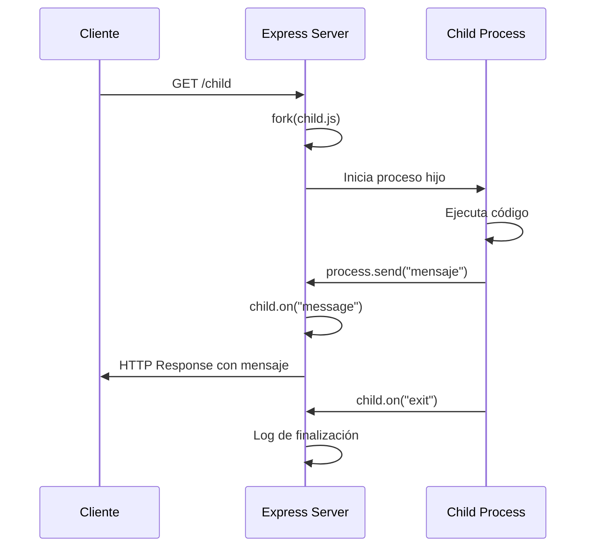
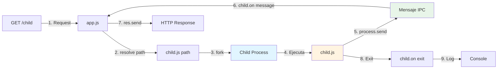
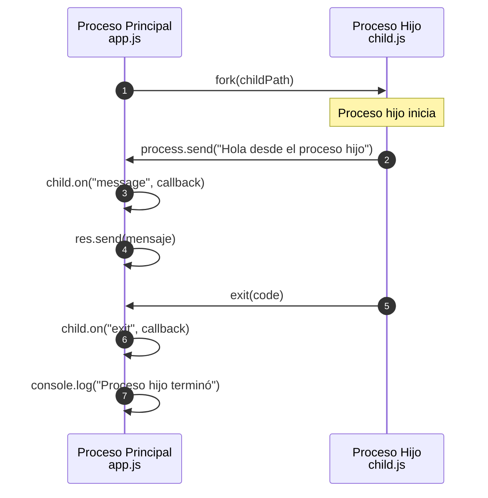

# Backend III - Clases

Aplicación backend desarrollada con Node.js y Express que demuestra el uso de procesos hijos mediante `fork()` para ejecutar tareas en paralelo.

## 📋 Tabla de Contenidos

- [Descripción](#descripción)
- [Arquitectura](#arquitectura)
- [Estructura del Proyecto](#estructura-del-proyecto)
- [Funcionamiento](#funcionamiento)
- [Proceso Hijo](#proceso-hijo)
- [Instalación](#instalación)
- [Configuración](#configuración)
- [Uso](#uso)
- [Endpoints](#endpoints)
- [Tecnologías](#tecnologías)

## 📝 Descripción

Esta aplicación es un servidor Express que implementa un sistema de gestión de entornos múltiples y demuestra la comunicación entre procesos padre e hijo en Node.js. Utiliza `child_process.fork()` para crear procesos hijos que ejecutan tareas de forma independiente, permitiendo una mejor gestión de recursos y tareas asíncronas.

## 🏗️ Arquitectura

La aplicación sigue una arquitectura modular basada en Node.js con las siguientes características:

- **Servidor Express**: Maneja las peticiones HTTP
- **Gestión de Entornos**: Sistema de configuración multi-entorno mediante archivos `.env`
- **Procesos Hijos**: Implementación de procesos independientes mediante `fork()`
- **CLI Arguments**: Gestión de argumentos de línea de comandos con Commander.js

### Diagrama de Arquitectura General

```mermaid
graph TB
    A[Usuario/Cliente] -->|HTTP Request| B[Express Server app.js]
    B -->|Lee argumentos CLI| C[Commander.js]
    C -->|Valida entorno| D{Entorno válido?}
    D -->|No| E[Error y Exit]
    D -->|Sí| F[Carga .env.{env}]
    F -->|Configura variables| G[Inicia Express]
    G -->|Escucha en PORT| H[Servidor Activo]
    H -->|GET /| I[Respuesta: Hola desde node]
    H -->|GET /secret| J[Respuesta: SECRET]
    H -->|GET /child| K[Fork child.js]
    K -->|Crea proceso hijo| L[Child Process]
    L -->|process.send| M[Mensaje al padre]
    M -->|child.on message| N[Respuesta HTTP]
```

## 📁 Estructura del Proyecto

```
backendIII-clases/
│
├── app.js                 # Servidor principal Express
├── child.js               # Proceso hijo ejecutado con fork()
├── argumentos.js          # Archivo auxiliar (vacío)
├── package.json           # Configuración del proyecto y dependencias
├── package-lock.json      # Lock file de dependencias
├── .gitignore            # Archivos ignorados por Git
├── LICENCE               # Licencia del proyecto
├── README.md             # Este archivo
│
└── .env.{env}            # Archivos de configuración por entorno
    ├── .env.local        # Configuración local
    ├── .env.dev          # Configuración desarrollo
    ├── .env.qa           # Configuración QA
    └── .env.prod         # Configuración producción
```

## ⚙️ Funcionamiento

### Flujo de Inicialización

1. **Inicio de la Aplicación**: Se ejecuta `app.js` con un argumento opcional `--env`
2. **Validación de Entorno**: Commander.js parsea los argumentos y valida que el entorno sea uno de: `local`, `dev`, `qa`, `prod`
3. **Carga de Configuración**: Se carga el archivo `.env.{entorno}` correspondiente usando `dotenv`
4. **Inicialización del Servidor**: Express se configura con las variables de entorno cargadas
5. **Servidor Activo**: El servidor escucha en el puerto especificado en `PORT` (default: 3000)

### Flujo de Peticiones HTTP



## 🔄 Proceso Hijo

El sistema de procesos hijos utiliza `child_process.fork()` de Node.js para crear procesos independientes. Este mecanismo permite:

- **Aislamiento**: Cada proceso hijo tiene su propio espacio de memoria
- **Comunicación IPC**: Los procesos se comunican mediante mensajes
- **Manejo de Errores**: Errores en el hijo no afectan al proceso padre
- **Gestión de Recursos**: Mejor control sobre el uso de CPU y memoria

### Diagrama del Proceso Hijo



### Comunicación entre Procesos



### Eventos del Proceso Hijo

La aplicación maneja tres eventos principales del proceso hijo:

1. **`message`**: Se dispara cuando el proceso hijo envía un mensaje con `process.send()`
2. **`error`**: Se dispara si ocurre un error durante la ejecución del proceso hijo
3. **`exit`**: Se dispara cuando el proceso hijo termina su ejecución

## 🚀 Instalación

1. Clona el repositorio:
```bash
git clone https://github.com/gondev94/backendIII-clases.git
cd backendIII-clases
```

2. Instala las dependencias:
```bash
npm install
```

## ⚙️ Configuración

### Variables de Entorno

Crea archivos `.env.{entorno}` en la raíz del proyecto para cada entorno:

**`.env.local`** (desarrollo local):
```env
PORT=3000
SECRET=local-secret-key
```

**`.env.dev`** (desarrollo):
```env
PORT=3000
SECRET=dev-secret-key
```

**`.env.qa`** (QA):
```env
PORT=3000
SECRET=qa-secret-key
```

**`.env.prod`** (producción):
```env
PORT=3000
SECRET=production-secret-key
```

### Entornos Permitidos

La aplicación valida que el entorno sea uno de los siguientes:
- `local`
- `dev`
- `qa`
- `prod`

Si se proporciona un entorno inválido, la aplicación terminará con un error.

## 💻 Uso

### Desarrollo Local
```bash
npm run dev
```
Esto ejecuta la aplicación con `nodemon` y entorno `local`.

### Producción
```bash
npm start
```
Esto ejecuta la aplicación con entorno `prod`.

### Ejecución Manual
```bash
# Desarrollo
node app.js --env dev

# QA
node app.js --env qa

# Producción
node app.js --env prod

# Local
node app.js --env local
```

## 🌐 Endpoints

### `GET /`
Retorna un mensaje de bienvenida.

**Respuesta:**
```
Hola desde node
```

### `GET /secret`
Retorna el valor de la variable de entorno `SECRET` configurada según el entorno.

**Respuesta:**
```
Tu secreto es: {SECRET}
```

### `GET /child`
Ejecuta un proceso hijo que envía un mensaje al proceso principal.

**Flujo:**
1. Crea un proceso hijo usando `fork()` que ejecuta `child.js`
2. El proceso hijo envía un mensaje: `"Hola desde el proceso hijo"`
3. El proceso principal recibe el mensaje y lo envía como respuesta HTTP
4. Se registra cuando el proceso hijo termina

**Respuesta:**
```
Mensaje del proceso hijo: Hola desde el proceso hijo
```

**Eventos manejados:**
- `message`: Recibe mensajes del proceso hijo
- `error`: Maneja errores del proceso hijo (responde con 500)
- `exit`: Registra cuando el proceso hijo termina

## 🛠️ Tecnologías

- **Node.js**: Runtime de JavaScript
- **Express**: Framework web para Node.js
- **Commander.js**: Biblioteca para manejo de argumentos CLI
- **dotenv**: Carga variables de entorno desde archivos `.env`
- **child_process**: Módulo nativo de Node.js para crear procesos hijos

## 📦 Dependencias

### Producción
- `express`: ^4.22.1
- `commander`: ^14.0.3
- `dotenv`: ^16.6.1

### Desarrollo
- `nodemon`: ^3.1.9

## 👤 Autor

**Gonzalo Peralta**

- GitHub: [@gondev94](https://github.com/gondev94)
- Repositorio: [backendIII-clases](https://github.com/gondev94/backendIII-clases)

## 📄 Licencia

Este proyecto está bajo la Licencia MIT. Ver el archivo `LICENCE` para más detalles.

---

## 🔍 Ejemplo de Uso Completo

```bash
# 1. Iniciar el servidor en modo desarrollo
npm run dev

# 2. En otra terminal, hacer peticiones:
curl http://localhost:3000/
# Respuesta: Hola desde node

curl http://localhost:3000/secret
# Respuesta: Tu secreto es: local-secret-key

curl http://localhost:3000/child
# Respuesta: Mensaje del proceso hijo: Hola desde el proceso hijo
```

## 📚 Conceptos Clave

### Fork vs Spawn

- **`fork()`**: Especializado para procesos Node.js, permite comunicación IPC automática
- **`spawn()`**: Más general, para ejecutar cualquier comando del sistema

### IPC (Inter-Process Communication)

La comunicación entre procesos padre e hijo se realiza mediante:
- `process.send()`: Envía mensajes desde el hijo al padre
- `child.on('message')`: Escucha mensajes del hijo en el padre

### Gestión de Entornos

El sistema permite cambiar la configuración sin modificar código:
- Variables de entorno por archivo
- Validación de entornos permitidos
- Carga dinámica según argumento CLI
